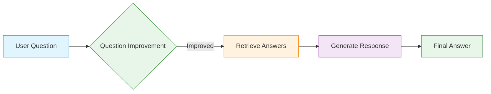

# 🛍️ E-Commerce AI Assistant

[](https://www.python.org/)
[](https://pytorch.org/)
[](https://huggingface.co/transformers/)
[](https://opensource.org/licenses/MIT)
[](https://colab.research.google.com/)

> **Note**: This is a research project demonstrating AI-powered e-commerce assistance. For production use, additional testing and optimization are recommended.

## 🚀 Project Overview

E-Commerce AI Assistant is an intelligent system designed to enhance online shopping experiences through natural language understanding. It combines advanced NLP techniques with deep learning to provide accurate product information and answer customer queries in real-time.

### Key Capabilities

🛒 **Smart Product Search**  
Find products using natural language queries instead of keywords

❓ **Instant Q&A**  
Get accurate answers to product-related questions

🔍 **Semantic Understanding**  
Understands customer intent beyond simple keyword matching

💡 **Context-Aware**  
Maintains conversation context for more natural interactions

## 🛠️ Core Components

### 1. Question Answering System
- **Dual-Encoder Model**: Matches user questions with relevant answers using semantic similarity
- **Two-Phase Processing**:
  1. **Retrieval**: Finds most relevant answers from the knowledge base
  2. **Generation**: Generates natural-sounding responses

### 2. Product Search Engine
- **Vector Similarity Search**: Powered by FAISS for fast retrieval
- **Category-Based Filtering**: Narrow down results by product categories
- **Multilingual Support**: Understands queries in multiple languages

### 3. Workflow Management
- **Stateful Processing**: Tracks conversation context
- **Modular Design**: Easy to extend with new features
- **Error Handling**: Graceful degradation when needed

## 🛠 Technical Stack

### Core Technologies
| Component | Technology |
|-----------|------------|
| Language | Python 3.8+ |
| ML Framework | PyTorch |
| NLP | 🤗 Transformers |
| Vector Search | FAISS |
| Web Framework | Flask |
| API Documentation | Swagger/OpenAPI |

### AI Models
| Model | Purpose |
|-------|---------|
| `sentence-transformers/all-MiniLM-L6-v2` | Text embeddings |
| `distilbert-base-cased-distilled-squad` | Question answering |
| `google/flan-t5-base` | Response generation |

### Performance
- **Response Time**: Typically under 1 second
- **Accuracy**: Improves with more training data
- **Scalability**: Designed to handle multiple concurrent users

## 🚀 Quick Start

### Prerequisites
- Python 3.8 or higher
- pip package manager
- (Optional) CUDA-compatible GPU for faster inference

### Installation

1. **Clone the repository**
```bash
git clone https://github.com/yourusername/ecommerce-ai-assistant.git
cd ecommerce-ai-assistant
```

2. **Set up virtual environment**
```bash
python -m venv venv
source venv/bin/activate  # On Windows: venv\Scripts\activate
```

3. **Install dependencies**
```bash
pip install -r requirements.txt
```

4. **Set up environment variables**
Create a `.env` file:
```env
GROQ_API_KEY=your_groq_api_key
LANGCHAIN_API_KEY=your_langchain_api_key
```

## 🏗 System Architecture

### Workflow Overview



### 1. Question Processing
- **Input**: Raw user question (e.g., "phone not charging")
- **Processing**:
  - Removes noise and normalizes text
  - Identifies key entities and intents
  - Rewrites for clarity if needed
- **Output**: Clean, structured query

### 2. Answer Retrieval
- **Search**: Finds most relevant product information
- **Ranking**: Sorts by relevance to the query
- **Filtering**: Applies category and other filters

### 3. Response Generation
- **Context Integration**: Combines query context with product data
- **Natural Language Generation**: Creates human-like responses
- **Formatting**: Structures the response for clarity

## 🚀 Running the Application

### Start the QA Service
```bash
python chat-qna.py
```

### Start the Search Service
```bash
python search.py
```

Access the web interface at `http://localhost:5000`

## 📚 API Documentation

### Chat/Q&A Endpoint
```http
POST /api/ask
Content-Type: application/json

{
    "question": "How do I reset my device?",
    "conversation_id": "optional-session-id"
}
```

### Search Endpoint
```http
GET /api/search?q=wireless+earbuds&category=electronics
```

## 🧩 Example Usage

### Basic Question Answering
```python
from chat_qna import answer_natural_question

response = answer_natural_question("How do I reset my device?")
print(response["generated_answer"])
```

### Product Search
```python
from search import get_recommendations

results = get_recommendations("wireless earbuds", "electronics", top_k=5)
print(results[["name", "price", "rating"]].head())
```

## 🤝 Contributing

We welcome contributions! Here's how you can help:

1. **Report Bugs**: Open an issue with detailed steps to reproduce
2. **Suggest Features**: Share your ideas for improvement
3. **Submit Code**: Follow our coding standards and submit a pull request

### Development Setup

1. Install development dependencies:
```bash
pip install -r requirements-dev.txt
```

2. Run tests:
```bash
pytest tests/
```

## 📄 License

This project is licensed under the MIT License - see the [LICENSE](LICENSE) file for details.

## 🙏 Acknowledgments

- [Hugging Face](https://huggingface.co/) for the Transformers library
- [FAISS](https://github.com/facebookresearch/faiss) for efficient similarity search
- The open-source community for invaluable tools and libraries

---

<div align="center">
  <h3>Built with ❤️ for better e-commerce experiences</h3>
  <p>Making online shopping smarter, one query at a time</p>
</div>

### API Endpoints

#### Chat/Q&A Service
- `POST /api/ask` - Submit a question and get an AI-generated response

#### Search Service
- `GET /` - Search interface
- `GET /recommend` - API endpoint for product recommendations

### Model Training

#### Fine-tuning the Dual-Encoder
```bash
python train_dual_encoder.py --model_name sentence-transformers/all-MiniLM-L6-v2 --batch_size 32 --epochs 10
```

#### Training with LoRA
```bash
python train_lora.py --model_name distilbert/distilbert-base-cased-distilled-squad --use_4bit
```

## 🤝 Contributing

We welcome contributions! Please see our [Contributing Guidelines](CONTRIBUTING.md) for details.

1. Fork the repository
2. Create your feature branch (`git checkout -b feature/AmazingFeature`)
3. Commit your changes (`git commit -m 'Add some AmazingFeature'`)
4. Push to the branch (`git push origin feature/AmazingFeature`)
5. Open a Pull Request

## 📄 License

This project is licensed under the MIT License - see the [LICENSE](LICENSE) file for details.

## 👏 Acknowledgments

- [Hugging Face](https://huggingface.co/) for the Transformers library
- [Facebook Research](https://research.facebook.com/) for FAISS
- The open-source community for invaluable tools and libraries

---

<div align="center">
  <h3>Built with ❤️ for the future of e-commerce</h3>
  <p>Enhancing customer experiences through AI</p>
</div>
