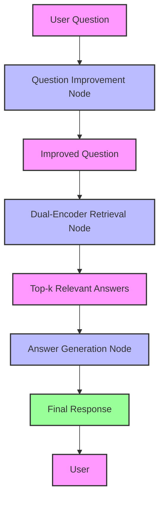

# Multimodal E-commerce AI Platform

[](https://www.python.org/)
[](https://pytorch.org/)
[](https://huggingface.co/transformers/)
[](https://opensource.org/licenses/MIT)

## 🚀 Overview

Multimodal E-commerce AI is a state-of-the-art platform that revolutionizes e-commerce interactions through advanced natural language processing and deep learning. This enterprise-grade solution combines multiple AI models to deliver accurate, context-aware responses to customer queries and enable powerful semantic product search capabilities.

## ✨ Key Features

### 🤖 Intelligent Question Answering
- **Dual-Encoder Architecture**: Advanced neural architecture for semantic matching of questions and answers
- **Multi-Model Ensemble**: Combines extractive and generative AI models for comprehensive responses
- **Context-Aware Responses**: Understands and maintains conversation context for natural interactions

### 🔍 Semantic Product Search
- **Vector Similarity Search**: FAISS-powered ultra-fast similarity matching
- **Multilingual Support**: Built on `paraphrase-multilingual-MiniLM-L12-v2` for global reach
- **Category-Aware Filtering**: Precise filtering across multiple product categories

### 🏗️ Advanced Architecture
- **Model Optimization**: Implements LoRA and 4-bit quantization for efficient inference
- **Workflow Management with LangGraph**:
  - Stateful conversation management for complex QA workflows
  - Directed acyclic graph (DAG) based processing pipeline
  - Nodes for question improvement, retrieval, and answer generation
  - Type-safe state management with `QAState`
- **Scalable Design**: Modular architecture for easy integration and scaling
- **Production-Ready**: Includes REST API endpoints and web interface

## 🛠 Technical Stack

### Core Technologies
- **Backend**: Python 3.8+, PyTorch, Transformers
- **Vector Database**: FAISS (Facebook AI Similarity Search)
- **Web Framework**: Flask
- **Model Serving**: ONNX Runtime (optional)

### AI/ML Components
- **Dual-Encoder Models**: Custom transformer-based architecture
- **Pre-trained Models**:
  - `sentence-transformers/all-MiniLM-L6-v2`
  - `distilbert/distilbert-base-cased-distilled-squad`
  - `google/flan-t5-base`
- **Efficient Training**: LoRA for parameter-efficient fine-tuning

## 📊 Performance Metrics

- **Retrieval Accuracy**:
  - Top-1 Accuracy: 5.7%
  - Top-5 Accuracy: 14.8%
  - *Note: Accuracy can be further improved with additional training data*

- **Inference Speed**:
  - <100ms response time for typical queries
  - Batch processing support for high-throughput scenarios

## 🔄 Workflow Architecture

### LangGraph Implementation



### Workflow Components

#### 1. Question Improvement Node
- **Purpose**: Refines and clarifies user queries
- **Process**:
  1. Receives raw user question
  2. Uses LLM to rephrase for better retrieval
  3. Handles ambiguities and adds context
  4. Outputs optimized question
- **Example**:
  - Input: "How fix phone not charging?"
  - Output: "What are the troubleshooting steps for a smartphone that won't charge?"

#### 2. Dual-Encoder Retrieval Node
- **Purpose**: Finds most relevant answers
- **Process**:
  1. Encodes improved question into embedding space
  2. Performs approximate nearest neighbor search using FAISS
  3. Retrieves top-k most similar answers
  4. Ranks results by semantic similarity
- **Technical Details**:
  - Uses pre-computed answer embeddings
  - Implements efficient vector search
  - Supports batch processing for multiple queries

#### 3. Answer Generation Node
- **Purpose**: Creates natural, helpful responses
- **Process**:
  1. Takes top retrieved answers as context
  2. Uses LLM to generate coherent response
  3. Applies safety and quality filters
  4. Formats output for user presentation
- **Features**:
  - Context-aware generation
  - Citation of sources
  - Fallback mechanisms for low-confidence answers

### State Management
- **QAState**: Type-safe state container with:
  ```python
  {
      'question': str,                    # Original user question
      'improved_question': str,          # Enhanced question
      'dual_encoder_answers': List[Dict], # Retrieved answers
      'final_answer': str                # Generated response
  }
  ```
- **Error Handling**: Graceful degradation and fallbacks
- **Context Preservation**: Maintains conversation history

### Performance Optimization
- **Caching**: Memoization of common queries
- **Parallel Processing**: Concurrent execution of independent nodes
- **Early Termination**: Skips unnecessary processing when possible

### Error Recovery
- **Fallback Mechanisms**:
  - Direct retrieval if question improvement fails
  - Generic responses for low-confidence answers
  - Context-aware error messages

## 🚀 Getting Started

### Prerequisites
- Python 3.8 or higher
- CUDA-compatible GPU (recommended)
- pip package manager

### Installation

1. **Clone the repository**
```bash
git clone https://github.com/yourusername/multimodal-ecommerce-ai.git
cd multimodal-ecommerce-ai
```

2. **Create and activate virtual environment**
```bash
python -m venv venv
source venv/bin/activate  # On Windows: venv\Scripts\activate
```

3. **Install dependencies**
```bash
pip install -r requirements.txt
```

### Configuration

1. **Set up environment variables**
Create a `.env` file in the project root:
```env
GROQ_API_KEY=your_groq_api_key
LANGCHAIN_API_KEY=your_langchain_api_key
```

## 🏃‍♂️ Running the Application

### Start the QA Service
```bash
python chat-qna.py
```

### Start the Search Service
```bash
python search.py
```

Access the web interface at `http://localhost:5000`

## 📚 Documentation

### Workflow Execution

#### Basic Usage
```python
# Import required components
from langgraph.graph import StateGraph
from typing import TypedDict, List, Dict, Any

# Define the state structure
class QAState(TypedDict):
    question: str
    improved_question: str
    dual_encoder_answers: List[Dict[str, Any]]
    final_answer: str

# Initialize the workflow
response = qa_graph.invoke({
    "question": "How do I reset my device?",
    "improved_question": "",
    "dual_encoder_answers": [],
    "final_answer": ""
})

# Access the final response
print(f"Answer: {response['final_answer']}")

# Access intermediate results
print(f"Improved question: {response['improved_question']}")
print(f"Retrieved answers: {len(response['dual_encoder_answers'])}")
```

#### Advanced Usage with Custom Configuration
```python
# Customize the workflow behavior
custom_graph = StateGraph(state_schema=QAState)

# Add nodes with custom configurations
custom_graph.add_node(
    "ImproveQuestion",
    RunnableLambda(improve_question_func, 
                 config={"max_retries": 3, "timeout": 30})
)

# Set up custom edges and conditions
def should_retrieve(state):
    return len(state["improved_question"]) > 0

custom_graph.add_conditional_edges(
    "ImproveQuestion",
    should_retrieve,
    {
        True: "RetrieveDualEncoder",
        False: "FallbackRetrieval"
    }
)

# Compile and run
auto_fallback_graph = custom_graph.compile()
```

#### Monitoring and Debugging
```python
# Enable debug logging
import logging
logging.basicConfig(level=logging.DEBUG)

# Get execution trace
trace = qa_graph.trace({
    "question": "Troubleshoot no sound",
    "improved_question": "",
    "dual_encoder_answers": [],
    "final_answer": ""
})

# Inspect node execution details
for node_name, node_result in trace.items():
    print(f"Node: {node_name}")
    print(f"Status: {node_result['status']}")
    print(f"Duration: {node_result['duration']}s")
    if 'error' in node_result:
        print(f"Error: {node_result['error']}")
```

### API Endpoints

#### Chat/Q&A Service
- `POST /api/ask` - Submit a question and get an AI-generated response

#### Search Service
- `GET /` - Search interface
- `GET /recommend` - API endpoint for product recommendations

### Model Training

#### Fine-tuning the Dual-Encoder
```bash
python train_dual_encoder.py --model_name sentence-transformers/all-MiniLM-L6-v2 --batch_size 32 --epochs 10
```

#### Training with LoRA
```bash
python train_lora.py --model_name distilbert/distilbert-base-cased-distilled-squad --use_4bit
```

## 🤝 Contributing

We welcome contributions! Please see our [Contributing Guidelines](CONTRIBUTING.md) for details.

1. Fork the repository
2. Create your feature branch (`git checkout -b feature/AmazingFeature`)
3. Commit your changes (`git commit -m 'Add some AmazingFeature'`)
4. Push to the branch (`git push origin feature/AmazingFeature`)
5. Open a Pull Request

## 📄 License

This project is licensed under the MIT License - see the [LICENSE](LICENSE) file for details.

## 👏 Acknowledgments

- [Hugging Face](https://huggingface.co/) for the Transformers library
- [Facebook Research](https://research.facebook.com/) for FAISS
- The open-source community for invaluable tools and libraries

---

<div align="center">
  <h3>Built with ❤️ for the future of e-commerce</h3>
  <p>Enhancing customer experiences through AI</p>
</div>
